<p align="center">
  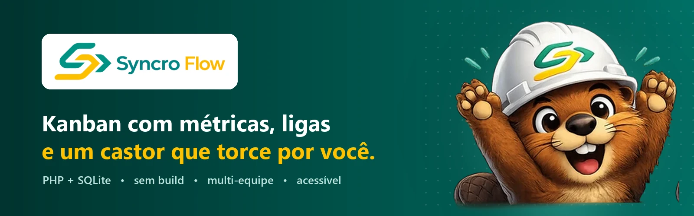
</p>

<p align="center">
  
  
  
  
  
</p>

<p align="center">
  <b>Um quadro Kanban completo, bonito e divertido — que roda em qualquer lugar com PHP.</b><br>
  Sem Composer, sem npm, sem Docker, sem etapa de build: clone, rode um comando e pronto.
</p>

<p align="center">
  <a href="#-como-rodar">Como rodar</a> ·
  <a href="#-por-dentro">Prints</a> ·
  <a href="#-conheça-o-tobi">O mascote</a> ·
  <a href="#-recursos">Recursos</a> ·
  <a href="#-documentação">Documentação</a>
</p>

<br>

<p align="center">
  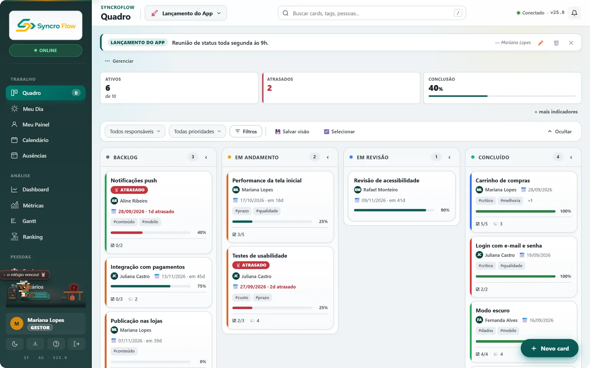
</p>

## ✨ Por que o SyncroFlow?

- 🧭 **Clareza** — quadros por equipe, filtros, raias e indicadores mostram na hora o que está andando e o que travou.
- 📈 **Resultado mensurável** — cada card registra horas e dinheiro economizados; o dashboard transforma isso em projeção mensal e anual.
- 🏆 **Ritmo** — ligas semanais, quase 100 conquistas e um mascote que comemora (e dá bronca) junto com o time.
- 🪶 **Leveza** — PHP + SQLite em uma pasta. Publicar é copiar arquivos; o banco se cria sozinho.

## 🚀 Como rodar

Você só precisa do **PHP 7.4 ou superior** (com `pdo_sqlite`, `mbstring`, `openssl` e `fileinfo`, que já vêm na maioria das instalações).

```bash
git clone https://github.com/C03LHO/SyncroFlow-App.git
cd SyncroFlow-App
php -S localhost:8000
```

Abra **http://localhost:8000** e crie sua conta — o primeiro usuário vira o administrador. Não há nada para configurar: o banco é criado automaticamente na pasta `data/`.

**Quer ver tudo preenchido?** Gere dados de demonstração (12 pessoas, 4 equipes, 31 cards):

```bash
php scripts/seed_demo.php
```

e entre com `demo01@syncroflow.local` / `demo@2026`.

## 🖼 Por dentro

<table>
  <tr>
    <td width="50%">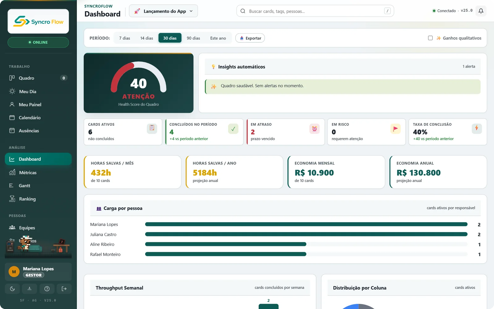<br><sub><b>Dashboard</b> — health score do quadro, insights automáticos e ganhos em horas e R$.</sub></td>
    <td width="50%">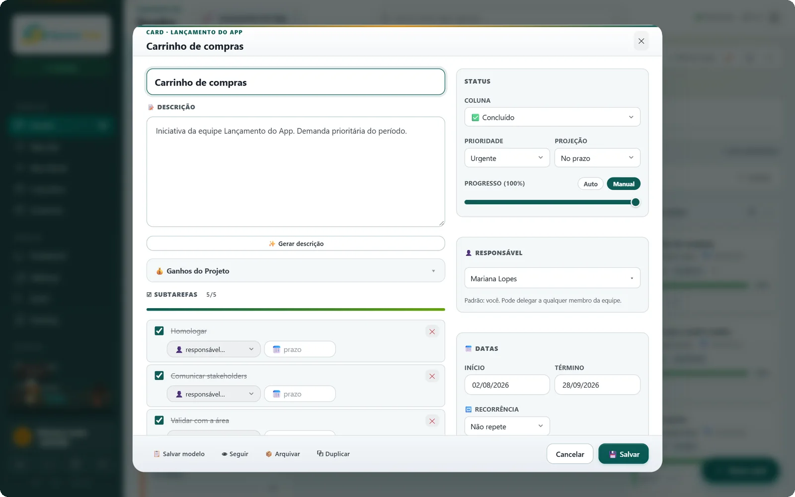<br><sub><b>Card</b> — subtarefas, responsáveis, datas, recorrência, ganhos e comentários.</sub></td>
  </tr>
  <tr>
    <td>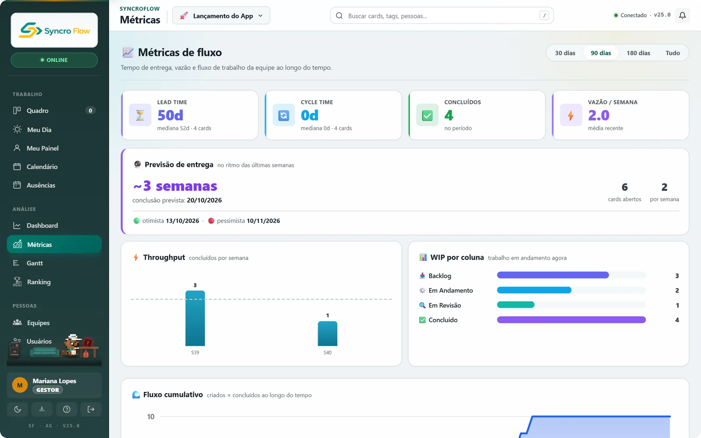<br><sub><b>Métricas de fluxo</b> — lead time, cycle time, throughput, WIP, CFD e previsão de entrega.</sub></td>
    <td>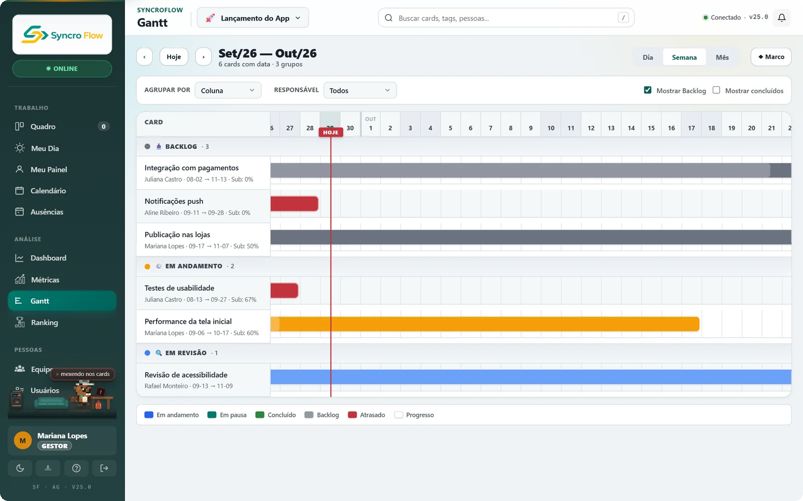<br><sub><b>Gantt</b> — linha do tempo por dia, semana ou mês, agrupada por coluna ou pessoa.</sub></td>
  </tr>
  <tr>
    <td>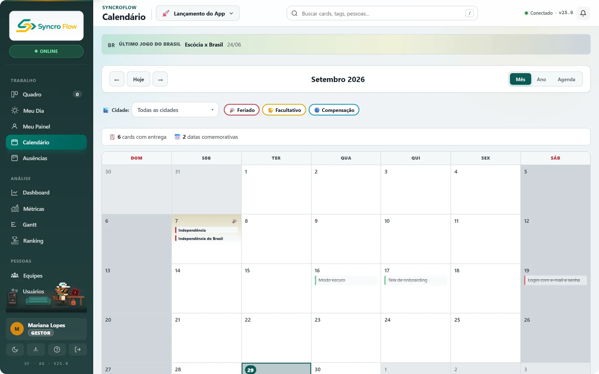<br><sub><b>Calendário</b> — entregas do mês com feriados nacionais e datas comemorativas.</sub></td>
    <td>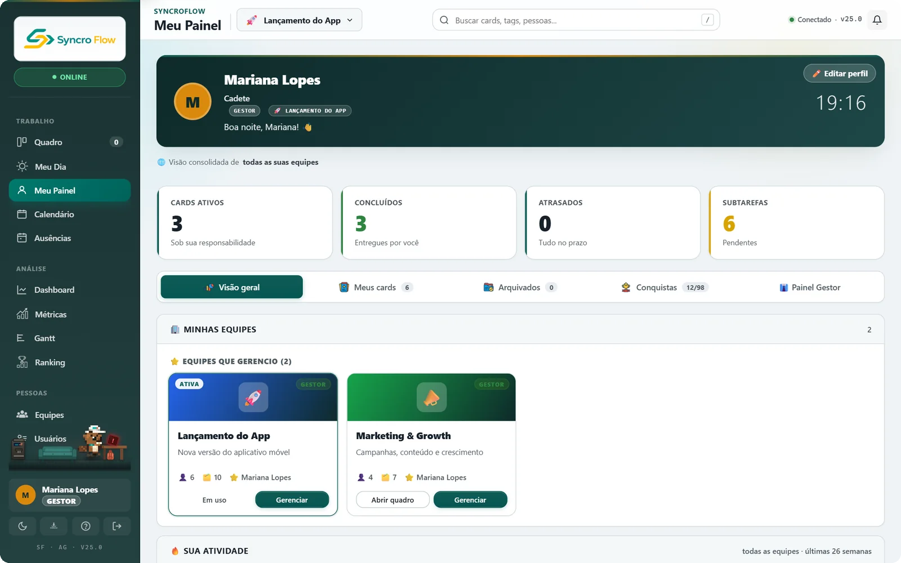<br><sub><b>Meu Painel</b> — seus números, suas equipes, conquistas e atividade.</sub></td>
  </tr>
  <tr>
    <td>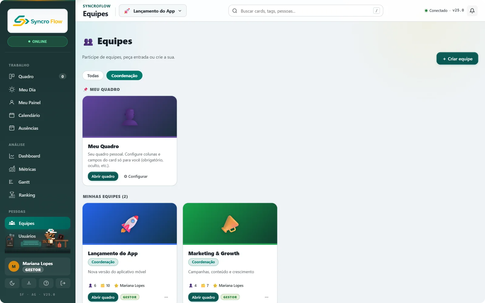<br><sub><b>Equipes</b> — quadros isolados, cargos por equipe, convites e pedidos de entrada.</sub></td>
    <td>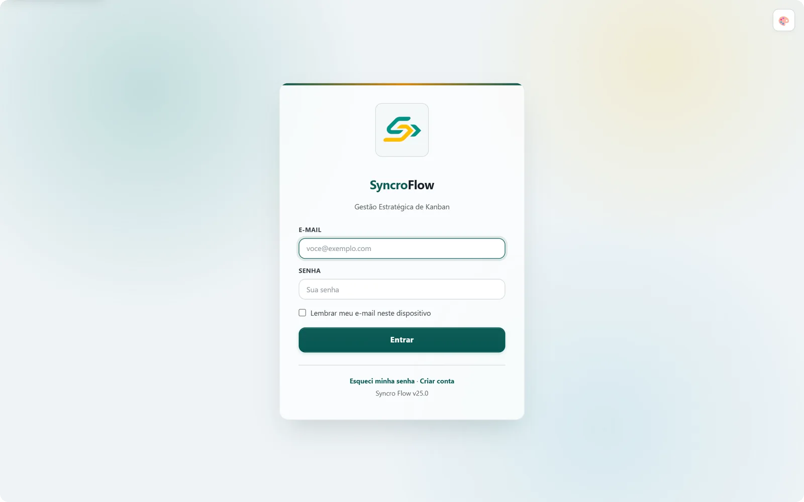<br><sub><b>Login</b> — acesso por e-mail, senha forte e recuperação por link.</sub></td>
  </tr>
</table>

### 🌙 Tema escuro e celular

<table>
  <tr>
    <td width="72%">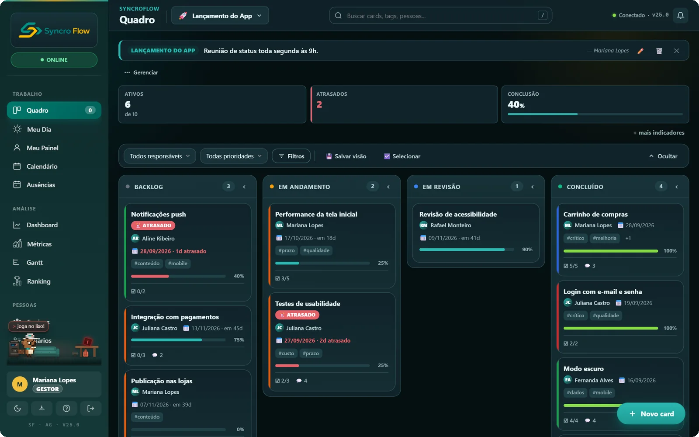</td>
    <td width="28%" align="center">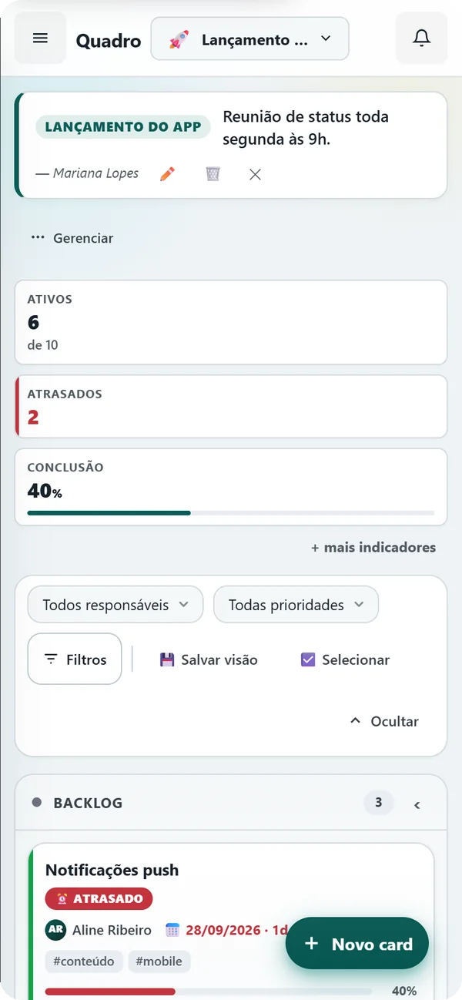</td>
  </tr>
</table>

São **8 temas** (claro, escuro, sage, dusk, sand, dracula, cyberpunk e abyss) e a interface se adapta ao celular.

## 🦫 Conheça o Tobi

O **Tobi** é o castor-engenheiro que acompanha o time. Ele apresenta o sistema no primeiro acesso, vive em **pixel art na barra lateral** — onde trabalha, toma café e reage ao quadro ("socorrooo, atrasou!") — e aparece nas horas de comemorar.

<p align="center">
  
  
  
  
  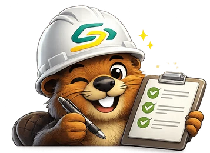
</p>

<p align="center">
  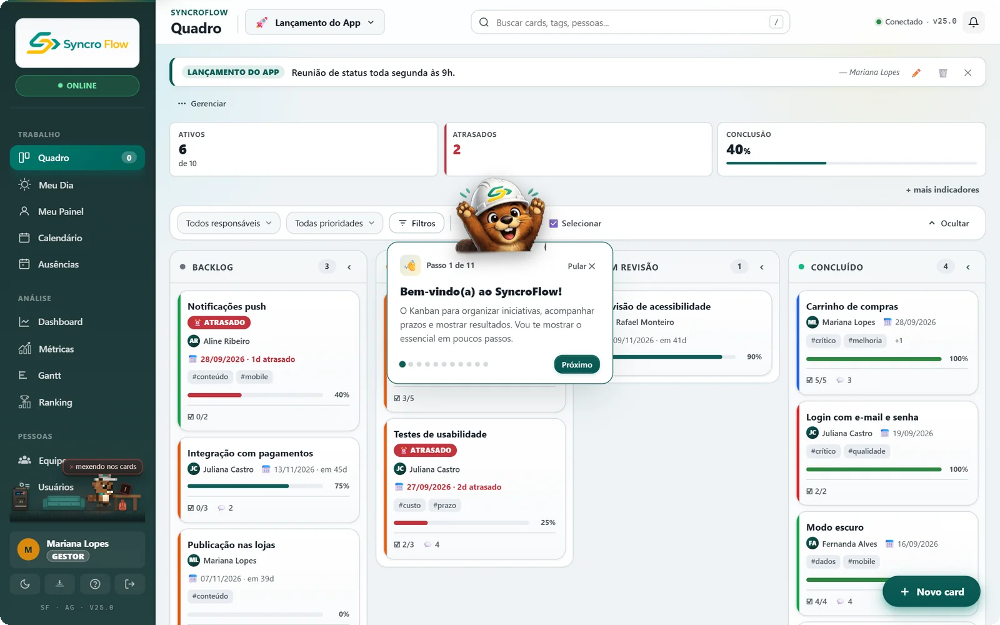<br>
  <sub>O tour de boas-vindas destaca cada parte da interface, passo a passo.</sub>
</p>

## 🏆 Ligas e conquistas

Toda semana, cada card concluído vale XP (bônus se foi no prazo). As pessoas sobem e descem por **10 ligas** de tema aquático:

<p align="center">
  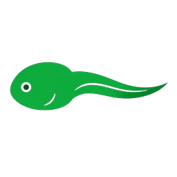
  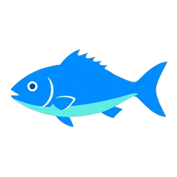
  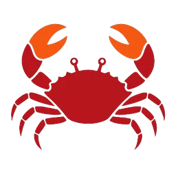
  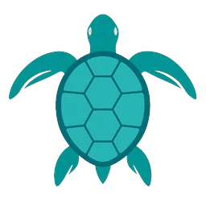
  
  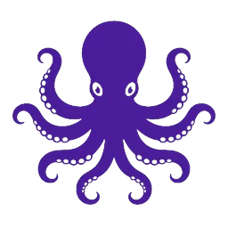
  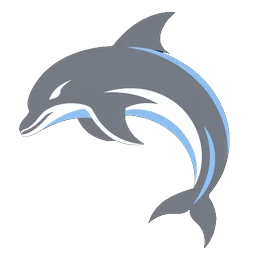
  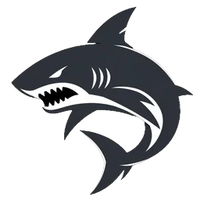
  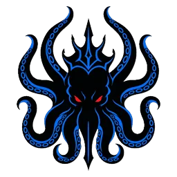
  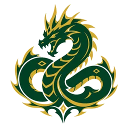
  <br>
  <sub>Girino → Peixe → Caranguejo → Tartaruga → Arraia → Polvo → Golfinho → Tubarão → Kraken → Leviatã</sub>
</p>

Além das ligas, há **98 conquistas individuais**, **13 troféus de equipe** e títulos para exibir no perfil.

## ♿ Acessível de verdade

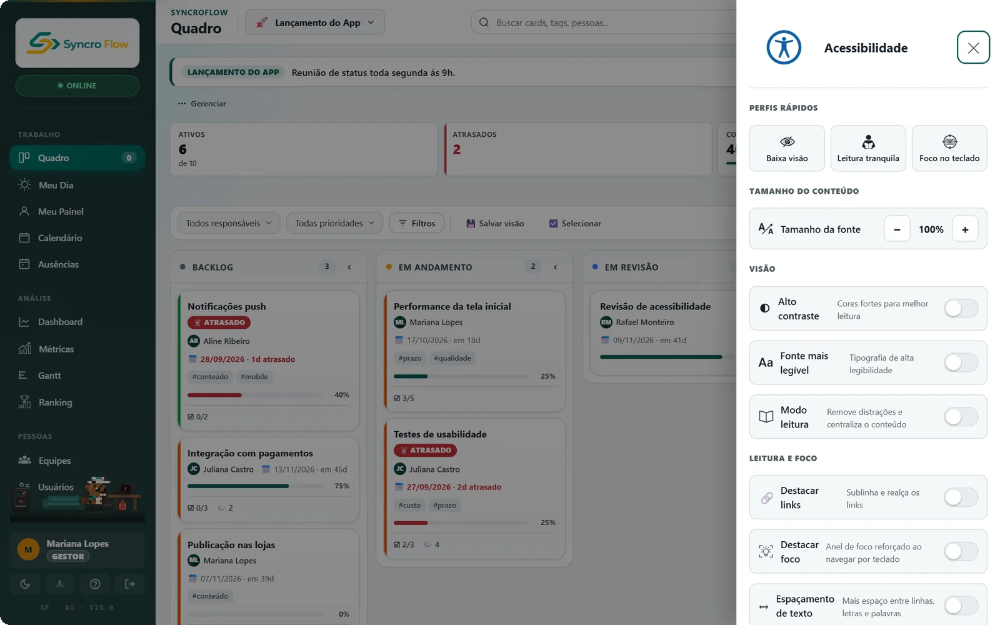

Um painel de acessibilidade sempre à mão, com perfis prontos (**baixa visão**, **leitura tranquila**, **foco no teclado**), tamanho de fonte, alto contraste, fonte mais legível, modo leitura, destaque de links e de foco, espaçamento de texto e redução de animações. Tudo também funciona pelo teclado.

## 🧩 Recursos

<table>
  <tr>
    <td valign="top" width="50%">

**Quadro e cards**
- Arrastar e soltar entre colunas, com WIP por coluna
- Filtros, raias (swimlanes) e visões salvas
- Subtarefas aninhadas com responsável e prazo
- Comentários com respostas e reações
- Etiquetas, prioridade, dependências entre cards
- Campos personalizados e modelos de card
- Cards recorrentes, arquivamento e aprovação
- Seleção em massa e busca global (<kbd>Ctrl</kbd>+<kbd>K</kbd>)

    </td>
    <td valign="top" width="50%">

**Gestão e análise**
- Múltiplas equipes com cargos por equipe
- Sprints, marcos e automações "quando… então…"
- Dashboard com health score e insights
- Métricas de fluxo e previsão de entrega
- Gantt, calendário e "Meu Dia"
- Férias e ausências com saldo por pessoa
- Mural de avisos com agendamento
- Exportação para CSV/Excel e relatório imprimível

    </td>
  </tr>
  <tr>
    <td valign="top">

**Segurança**
- Login por e-mail e senha forte obrigatória
- Senhas com bcrypt; limite de tentativas
- Sessão httpOnly e proteção contra CSRF
- Backups automáticos criptografados (AES-256-GCM)
- Dados fora da raiz web em produção

    </td>
    <td valign="top">

**Tempo real e praticidade**
- Sincronização entre usuários a cada 5 s
- Proteção contra edição simultânea do mesmo card
- Notificações no sistema e (opcional) por e-mail
- Atalhos: <kbd>N</kbd> novo card · <kbd>T</kbd> temas · <kbd>/</kbd> buscar
- Nenhuma dependência externa para instalar

    </td>
  </tr>
</table>

## 🧱 Como é feito

| Camada | Tecnologia |
|---|---|
| Backend | PHP 7.4+ com PDO — sem framework, sem Composer |
| Banco | SQLite em modo WAL (o schema se cria e se atualiza sozinho) |
| Frontend | JavaScript em ES Modules nativos + CSS modular — sem bundler |
| Sincronização | Polling a cada 5 s com *optimistic locking* por revisão |
| Testes | `php tests/auth_test.php` · CI no GitHub Actions (PHP 7.4 e 8.3) |

```
├── *.php         páginas (login, cadastro, app, admin…)
├── api/          endpoints JSON, um arquivo por área
├── lib/          regras de negócio, banco e autenticação
├── js/  css/     frontend
├── imagens/      logo, ícones, ligas e o Tobi
├── scripts/      manutenção pela linha de comando
├── tests/        testes automatizados
└── docs/         documentação
```

## 📚 Documentação

| | |
|---|---|
| [Manual do usuário](docs/MANUAL_DO_USUARIO.md) | Como usar o quadro, cards, equipes e as demais telas |
| [Deploy](docs/DEPLOY.md) | Publicar em produção (Apache, IIS ou nginx) |
| [Arquitetura](docs/ARQUITETURA.md) | Visão C4, estrutura de pastas e fluxos principais |
| [Modelo de dados](docs/MODELO_DE_DADOS.md) | Diagrama entidade-relacionamento |
| [API](docs/API.md) | Endpoints e ações |
| [Autenticação](docs/AUTENTICACAO.md) | Login, cadastro, recuperação de senha e limites |
| [Segurança](docs/SEGURANCA.md) | Criptografia, chaves e onde ficam os dados |
| [Decisões técnicas](docs/DECISOES_TECNICAS.md) | Por que o sistema é do jeito que é |

## 🤝 Contribuindo

Sugestões e melhorias são bem-vindas! O [CONTRIBUTING.md](CONTRIBUTING.md) explica como rodar, testar e o padrão de commits.

## 📄 Licença

[MIT](LICENSE) © Aurelio Sousa
