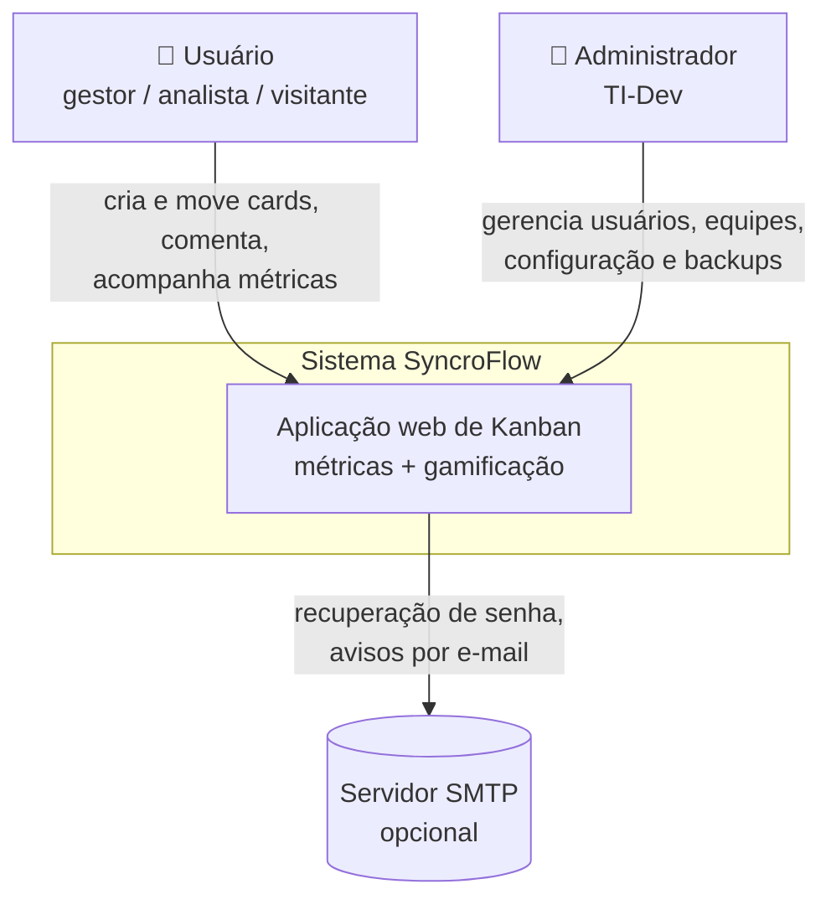
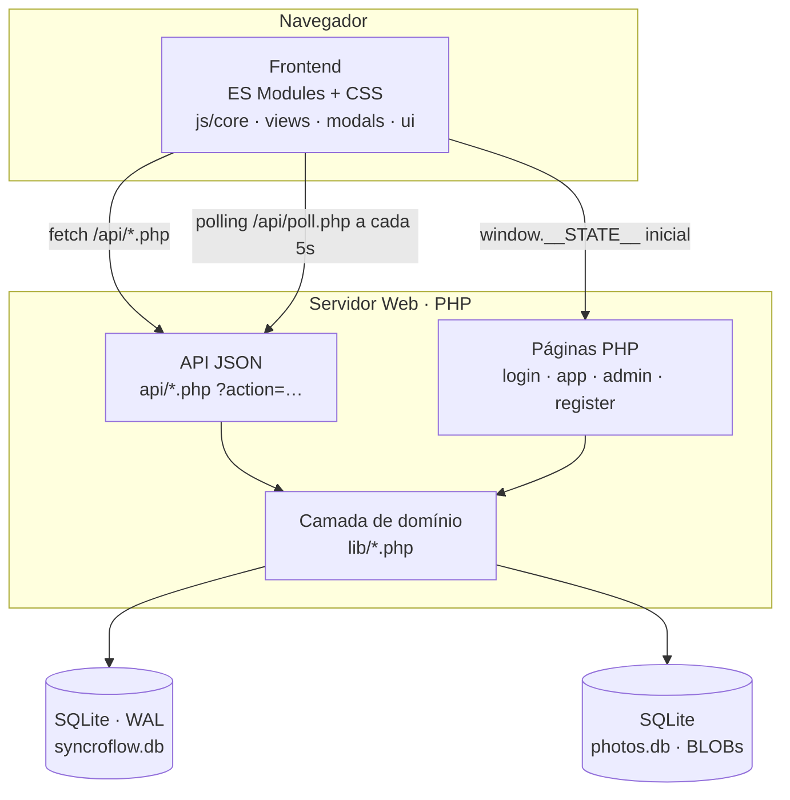
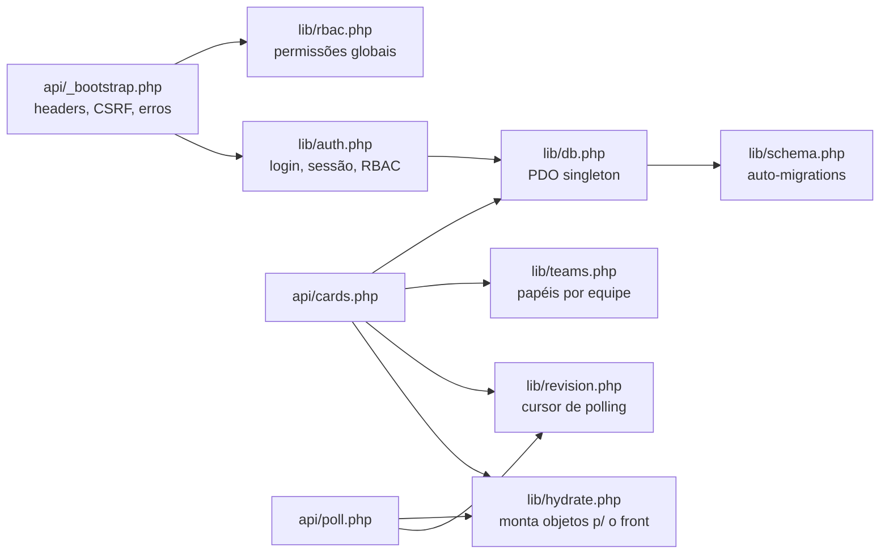
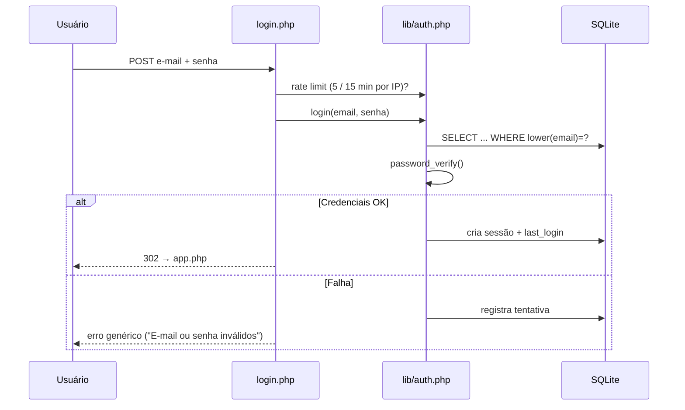
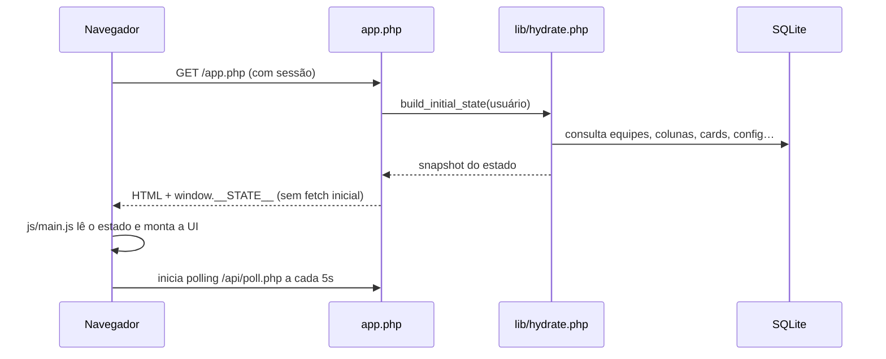
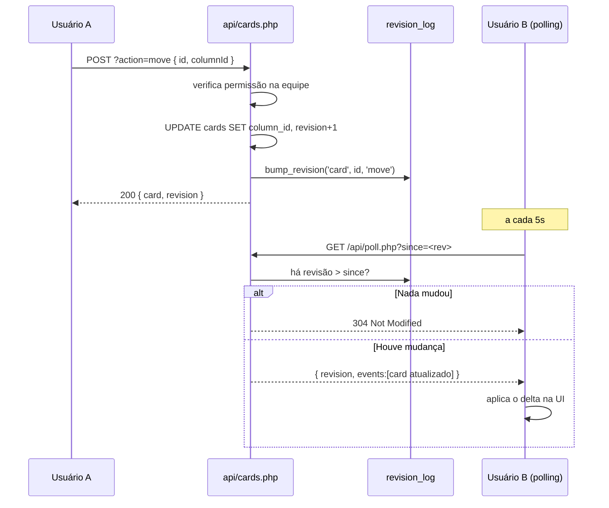
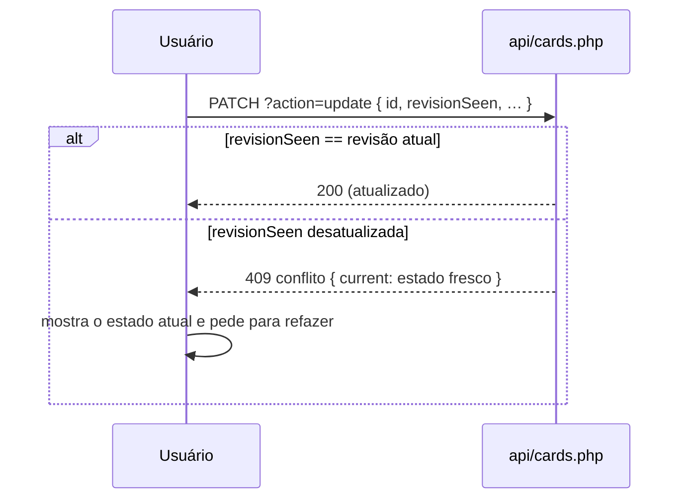

# Arquitetura

Visão arquitetural do sistema no modelo **C4** (Contexto → Contêiner → Componente).

## Resumo

SyncroFlow é uma aplicação web **monolítica e server-rendered**, deliberadamente simples de implantar: **PHP + SQLite, sem etapa de build**. O backend expõe endpoints JSON sob `/api/`, e o frontend é composto por **ES Modules nativos** que consomem esses endpoints e recebem o estado inicial injetado pelo PHP (`window.__STATE__`). A sincronização entre usuários é feita por **polling** com *optimistic locking* por número de revisão.

## Nível 1 — Contexto



## Nível 2 — Contêineres



## Nível 3 — Componentes (backend)



## Princípios de projeto

1. **Sem build.** Deploy = copiar a pasta. Nenhum bundler, nenhuma dependência instalável.
2. **Arquivos planos.** Cada `api/<entidade>.php` cuida de uma área, roteada por `?action=`.
3. **Auto-migrations permissivas.** `ALTER TABLE` em `try/catch`; o schema se monta sozinho no primeiro acesso.
4. **Estado injetado.** O PHP injeta `window.__STATE__` — o boot não faz *fetch* inicial.
5. **Optimistic locking.** Cada card tem `revision`; um PATCH conflitante recebe `409`.
6. **Polling barato.** `MAX(revision)` menor que o cursor do cliente → `304 Not Modified`.

## Concorrência e sincronização

O servidor é a fonte da verdade. Clientes fazem *polling* de `/api/poll.php?since=<rev>` a cada 5s; o servidor consolida as mudanças por entidade e devolve apenas o delta. Conflitos de edição de card são resolvidos por *optimistic locking* (campo `revision`).

## Estrutura de pastas

```
├── index.php  login.php  register.php  reset.php  logout.php  termos.php
├── app.php                  # aplicação (injeta window.__STATE__)
├── admin.php                # painel de administração
├── api/                     # endpoints JSON — um arquivo por área (?action=…)
├── lib/                     # domínio: db, schema, auth, rbac, teams, hydrate, leagues…
├── partials/                # pedaços de página: <head>, sidebar, topbar
├── js/                      # frontend em ES Modules (sem build)
│   ├── core/                # estado, API, roteador, regras de negócio no cliente
│   ├── views/               # uma tela por arquivo (quadro, dashboard, gantt…)
│   ├── modals/  ui/  a11y/  # modal do card, componentes, acessibilidade
│   └── tobi.js              # mascote animado
├── css/                     # CSS modular (parts/01-tokens … 10-a11y) + tobi.css
├── imagens/                 # logo, ícones, ligas e mascote (WebP)
├── scripts/                 # manutenção via linha de comando (init_db, seed_demo…)
├── tests/                   # testes automatizados (PHP puro)
└── docs/                    # esta documentação
```

## Fluxos principais

O fluxo completo de autenticação está em [AUTENTICACAO.md](AUTENTICACAO.md).

### Login (resumo)



### Boot da aplicação (estado injetado)



### Mover um card (com optimistic locking e polling)



### Conflito de edição (409)



Veja também: [MODELO_DE_DADOS.md](MODELO_DE_DADOS.md) · [DECISOES_TECNICAS.md](DECISOES_TECNICAS.md) · [API.md](API.md)
