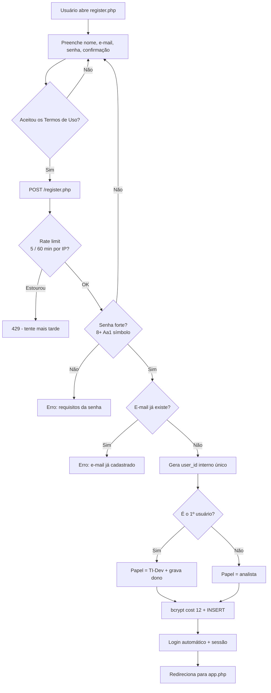
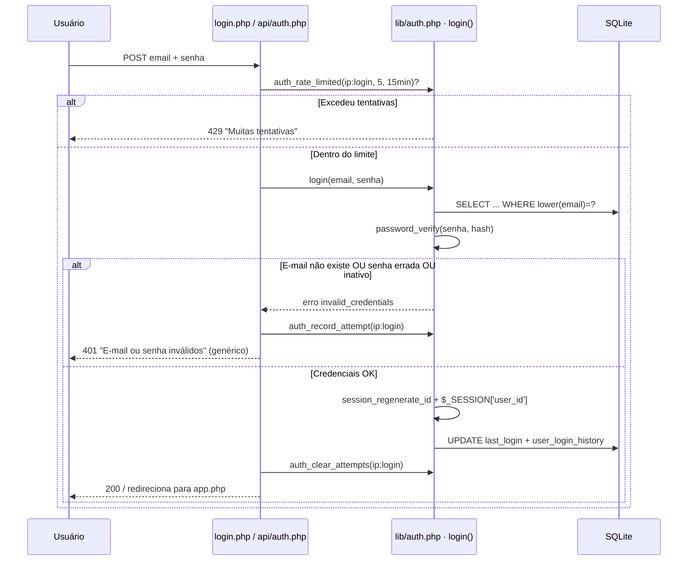
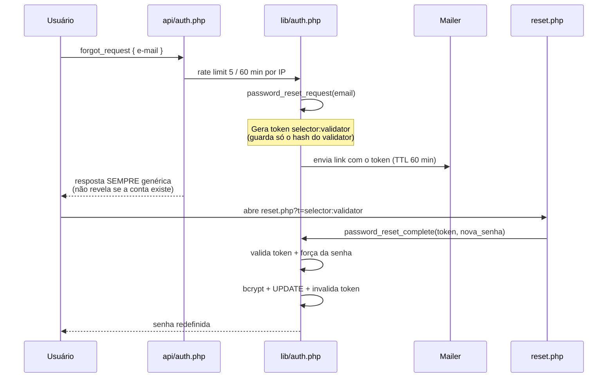

# SyncroFlow — Autenticação

Documentação do módulo de login e cadastro (repensado na Fase 3 da refatoração).

## Visão geral

| Aspecto | Decisão |
|---|---|
| **Credencial** | **E-mail + senha** (única forma de login) |
| **Identidade exibida** | **Nome** — nenhum ID/matrícula aparece na interface |
| **ID interno (`user_id`)** | Chave surrogate **gerada automaticamente**, nunca exibida nem digitada |
| **Hash de senha** | `password_hash(PASSWORD_BCRYPT, cost = 12)` |
| **Sessão** | Cookie **httpOnly + SameSite=Lax** (sessão nativa do PHP) |
| **Política de senha** | Mínimo 8, com maiúscula, minúscula, número e símbolo |
| **Rate limiting** | 5 tentativas / 15 min (login) e 5 / 60 min (cadastro, recuperação) |
| **Anti-enumeração** | Erro de login sempre genérico (`E-mail ou senha inválidos`) |
| **Administrador** | O **primeiro usuário** cadastrado vira TI-Dev e é gravado como dono |

### Por que sessão em cookie e não JWT?

O SyncroFlow é uma aplicação **PHP server-rendered, de servidor único e sem build**.
Toda a aplicação já usa `$_SESSION`, integrada ao polling e ao RBAC. JWT (stateless,
com refresh tokens e listas de revogação) adicionaria complexidade sem benefício neste
contexto. O cookie de sessão é `httpOnly` (imune a XSS via JS), `SameSite=Lax`
(mitiga CSRF) e, em produção HTTPS, deve ser `secure` (ver `config.json → session.secure_cookie`).
Há ainda um token "lembrar-me" por dispositivo (padrão *selector:validator*), do qual o
banco guarda apenas o hash do *validator*.

## Fluxos

### Cadastro (e primeiro acesso / bootstrap)



### Login



### Recuperação de senha ("Esqueci minha senha")



## Política de senha

Fonte única: `password_strength_error()` em `lib/auth.php`. Aplicada no cadastro,
na troca de senha e nas duas redefinições. Regras: **≥ 8 caracteres, com ao menos
uma maiúscula, uma minúscula, um número e um símbolo**. Retorna a mensagem do
primeiro critério que falhar, ou `null` se a senha for forte.

## Rate limiting

Implementação simples em SQLite (tabela `auth_attempts`, sem dependências externas):

- `auth_rate_limited($bucket, $max, $windowMin)` — conta tentativas na janela.
- `auth_record_attempt($bucket)` — registra uma falha (+ limpeza de registros > 24h).
- `auth_clear_attempts($bucket)` — zera o bucket após sucesso.

O `bucket` é `"<ip>:<ação>"` (ex.: `203.0.113.9:login`). Limites atuais: login
5/15 min; cadastro e recuperação 5/60 min. Ajuste os números em `api/auth.php` e
`login.php` conforme a necessidade.

## Migração anti-lockout

Contas antigas criadas sem e-mail (ex.: administrador semeado por versões anteriores)
receberiam "trava" no login por e-mail. A migração idempotente
`_migrate_emails_for_login()` (em `lib/schema.php`, roda a cada request via
`ensure_schema`) garante um e-mail utilizável: o dono recebe `admin@syncroflow.local`
e os demais um placeholder — todos trocáveis depois em Meu Painel.

## Testes

`tests/auth_test.php` roda **sem dependências** (sem Composer/PHPUnit), num banco
SQLite temporário e isolado (via a variável de ambiente `SYNCROFLOW_CONFIG`):

```bash
php tests/auth_test.php   # sai 0 se tudo passou; 1 se houve falha (ideal para CI)
```

Cobre: bootstrap (1º usuário vira admin/dono), papel do 2º usuário, e-mail
duplicado/inválido, os 5 critérios de senha forte, login correto, senha errada e
e-mail inexistente (mesmo erro genérico), rejeição do login por ID, rate limiting e
a migração anti-lockout.

## Como estender: login social (Google / GitHub via OAuth 2.0)

O login social foi deixado como **extensão opcional** (o núcleo não depende de
serviços externos nem de segredos). O padrão a seguir, quando quiser adicioná-lo:

1. **Registrar o app OAuth** no provedor (Google Cloud Console / GitHub Developer
   Settings) e obter `client_id` + `client_secret`. Guarde-os em `config.json`
   (fora do Git — já ignorado) ou em variáveis de ambiente. **Nunca** no código.

2. **Endpoint de início** — `api/oauth.php?action=start&provider=google`:
   - Gera um `state` aleatório na sessão (anti-CSRF) e redireciona para a URL de
     autorização do provedor, pedindo o escopo de e-mail/perfil.

3. **Callback** — `api/oauth.php?action=callback&provider=google`:
   - Valida o `state`; troca o `code` pelo `access_token` (POST ao endpoint de token
     do provedor); busca o perfil (nome + e-mail verificado).

4. **Vincular / criar conta** (reaproveitando o que já existe):
   - Se já houver usuário com aquele e-mail → cria a sessão (`$_SESSION['user_id']`).
   - Se não houver → `register_user('', <senha_aleatória>, $nome, null, $email)`
     (o `user_id` é gerado sozinho; o primeiro vira TI-Dev). Para contas 100%
     sociais, marque-as para não exigir senha local.
   - Opcional: tabela `user_identities (user_id, provider, provider_user_id)` para
     suportar múltiplos provedores por conta.

5. **Botões** nas telas — "Entrar com Google/GitHub" apontando para o endpoint de
   início. O restante (sessão, RBAC, polling) continua igual.

> Como o login já é por **e-mail**, o OAuth encaixa naturalmente: o provedor apenas
> fornece um e-mail verificado, e todo o resto do fluxo (sessão, papéis, dono) é o
> mesmo descrito acima.
