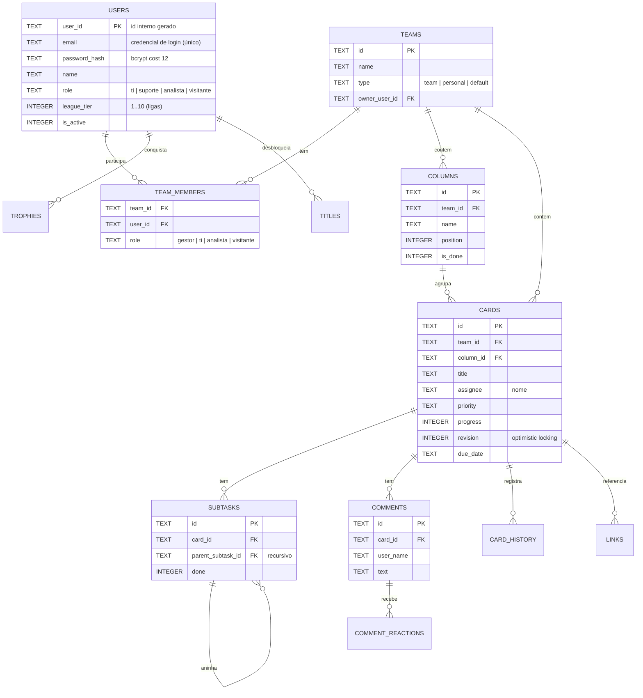

# Modelo de dados

O banco é **SQLite** (modo WAL). Todo o schema é criado e evoluído
automaticamente por `lib/schema.php` (auto-migrations idempotentes). Abaixo, o
modelo entidade-relacionamento das entidades centrais (o banco tem ~30 tabelas;
o diagrama foca no núcleo).

## Convenções

- **IDs**: UUID v4 em TEXT (`uid()`); o identificador de usuário (`user_id`) é um
  número interno gerado automaticamente.
- **Timestamps**: ISO-8601 UTC em TEXT (`now_iso()`).
- **Booleanos**: INTEGER 0/1.
- **Listas**: JSON em TEXT quando cabível.

## Diagrama ER (núcleo)

## Grupos de tabelas (visão geral)

| Grupo | Tabelas principais |
|---|---|
| Identidade | `users`, `user_login_history`, `access_requests`, `role_requests`, `auth_tokens`, `password_resets`, `auth_attempts` |
| Equipes | `teams`, `team_members`, `team_invites` |
| Kanban | `columns`, `cards`, `subtasks`, `comments`, `comment_reactions`, `card_history`, `card_tags`, `card_requested_by`, `card_helpers`, `card_blocks`, `card_watchers`, `links`, `custom_fields`, `card_custom_values` |
| Gamificação/métricas | `trophies`, `titles`, `monthly_performance`, `weekly_snapshots`, `role_history` |
| Produtividade | `sprints`, `milestones`, `card_templates`, `automations`, `vacations`, `holidays` |
| Notificações | `notifications`, `notices` |
| Sistema | `system_config`, `revision_log`, `backups`, `email_log`, `app_meta` |

## Sincronização

A tabela `revision_log` funciona como **cursor de polling**: cada mutação
registra uma linha, e `MAX(revision)` é o ponto de comparação usado por
`/api/poll.php`. Cards têm `revision` própria para *optimistic locking*.

## Segundo banco

Fotos de perfil e capas de equipe ficam em um **segundo arquivo SQLite** (`photos.db`)
como BLOBs, para manter o banco principal enxuto.
